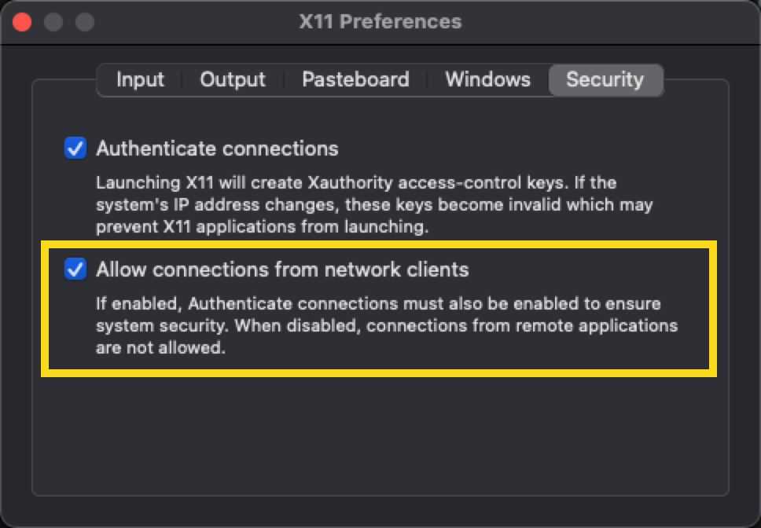

# 🚀 Apache JMeter GUI Docker Image 

This repository contains a Dockerfile for a Apache JMeter image which will launch GUI. 

## ✨ Features

- Includes the Apache JMeter for development and load testing.
- Includes a script for installing JMeter plugins.
- Secured, it will run as `jmeter` - non-root.

## 🎉 Image Size

- Compressed Size: 550.25 MB

## Prerequisites

### MacOS

- Install [XQuartz](https://www.xquartz.org/)
- Launch XQuartz > Settings
- Check `Allow connections from network clients` as shown below


##  🐳 Basic Usage

To run JMeter in GUI mode, you can use the following commands:

```bash
docker pull qainsights/jmeter-gui:latest
```
then run

```bash
chmod +x run.sh
./run.sh
```

##  🐳 🐳 Advanced Usage

### 📦 Installing JMeter plugins

In Dockerfile, add the required JMeter plugins to install in a comma separated values as shown below.

```bash
ARG JMETER_PLUGINS="jpgc-udp=0.4,jpgc-dummy"
```

To install specific version add `=` to specify the version, else the latest version will be installed.

```bash
docker build -t my-jmeter-image .
```

# 💻 Contributing
Contributions are welcome! Please feel free to submit a Pull Request.

